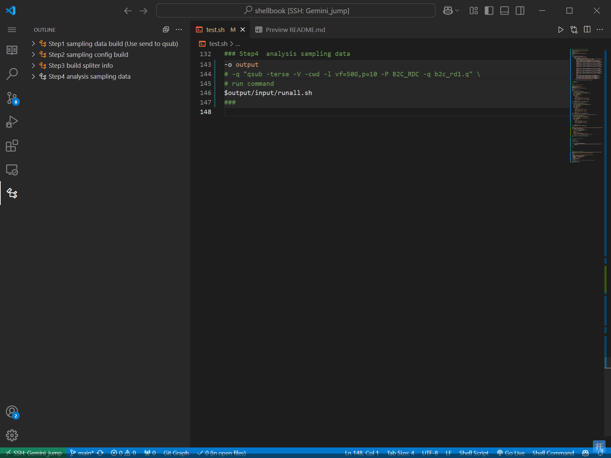
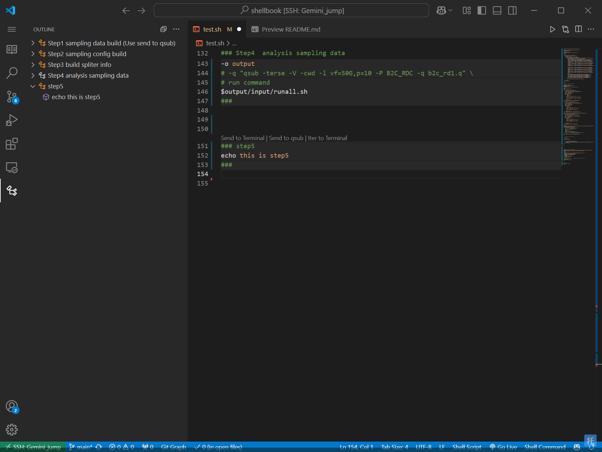
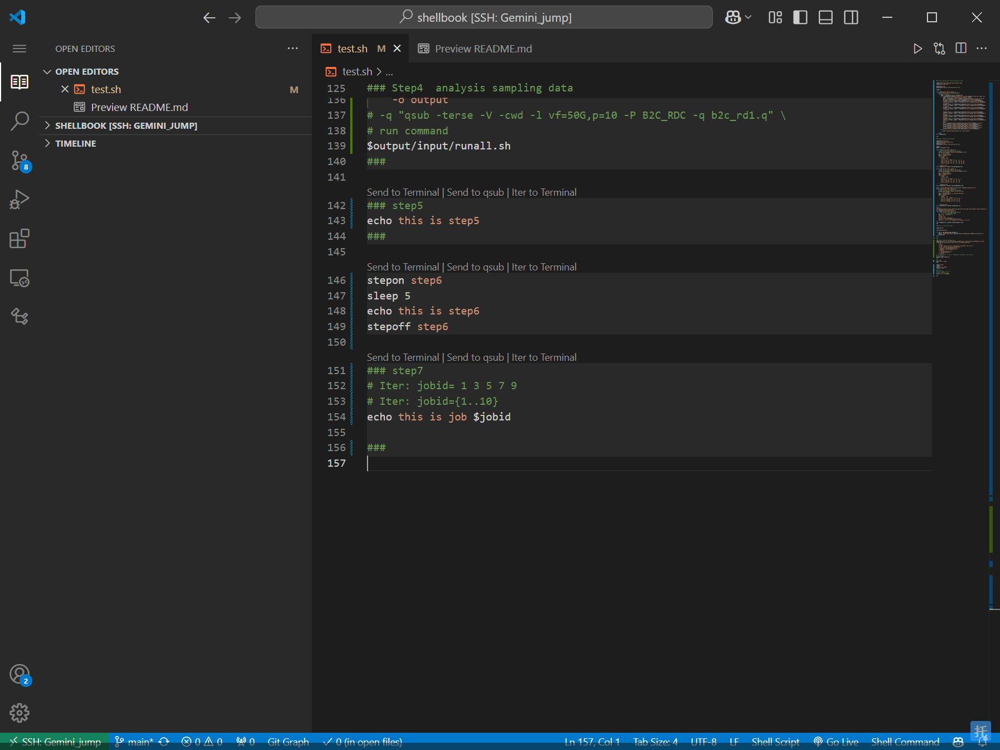
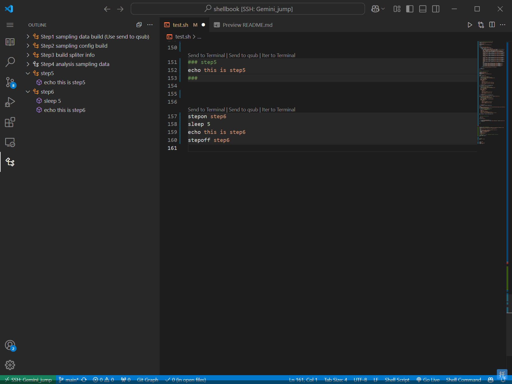
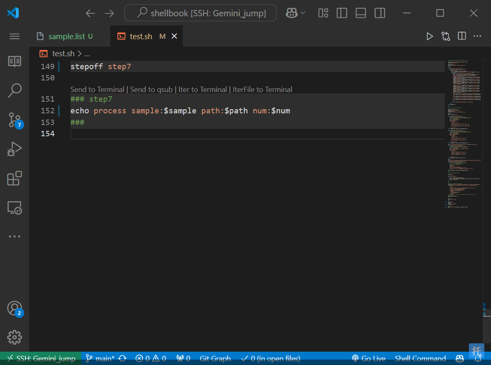
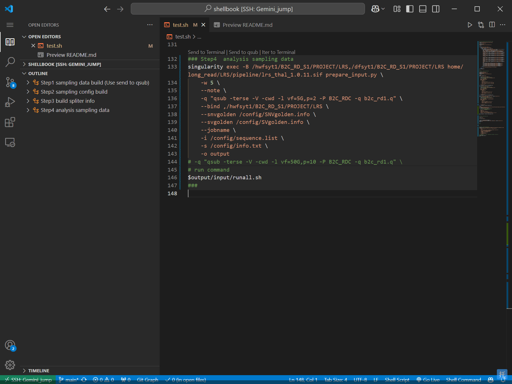
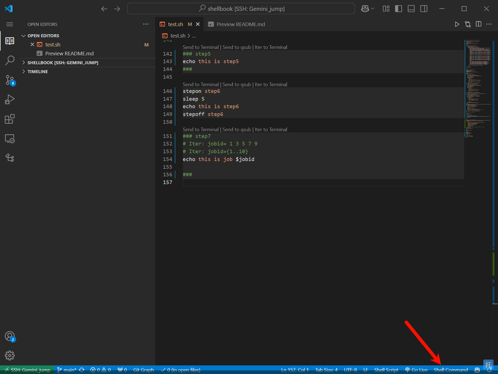
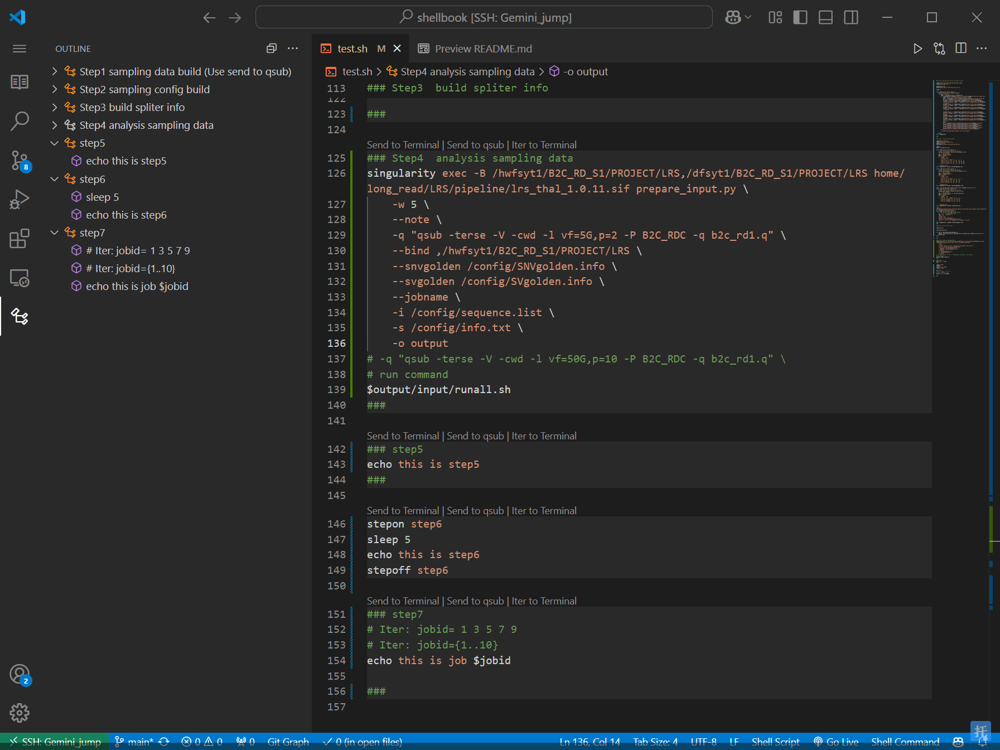

# Shell Book - The Shell notebook  Extension for VSCode

[中文README](./README_ZH.md)

Make your shell script as easy to use as a notebook, display code chunks, add snippets, enhance shell script development experience, and quickly execute custom commands.

**(作者)**：之前做R语言开发，觉得Rmarkdown特别方便，因此想在shell中实现一个类似的vscode扩展，已使用一年多，现在回看之前的shellbook，运行思路都很清晰,是代码运行、管理和协作很好的方案。

**设计理念**是按执行单元记录，每个分析任务新建一个shell来运行，减少终端直接输入代码的频率，平时会用一个home目录下的.sh来写codechunk运行，可以在未来很方便的复用chunk单元（history里只能记录单行，codechunk记录的是一段执行单元）；协作上只需要提供该shell路径，即是完整的运行方案，不需要沟通如何操作。

**(Author)**: Previously, I worked with R language development and found RMarkdown particularly convenient. Therefore, I wanted to implement a similar VSCode extension in the shell. I've been using it for over a year now, and looking back at the previous shellbook, the execution logic is very clear. It serves as an excellent solution for code execution, management, and collaboration.

**Design Concept**: It records according to execution units, creating a new shell for each analysis task to run. This reduces the frequency of directly entering code into the terminal. Usually, I write code chunks in a .sh file in the home directory for execution, which allows for easy reuse of chunk units in the future (since the history can only record single lines, while code chunks record an entire execution unit). For collaboration, you only need to provide the shell path, which serves as a complete execution plan, eliminating the need to communicate on how to operate it.

## Features

1. **Code Chunk**: show chunk in shell script, send chunk code to terminal for running or qsub to SGE.
2. **Code Snippets**: Quickly insert commonly used shell commands and structures into your script with our pre-built code snippets.
3. **Iterate Code Chunks**: Easily iterate over code chunks and execute them directly in the terminal, streamlining your workflow.
4. **qsub in SGE**: Easily run your code in SGE cluster use Send to qsub codelens.
5. **Auto-format**: Fast format your shell script, just use right click and choose format.
6. **Chunk Outline**: You can see your chunk outline in left panel, double click to check in.
7. **Quick Command**: Execute shell commands directly within the VSCode interface, just click Shell Command in statusBar.
8. **Independent Shell Execution**: Control whether code chunks run in independent subshells (using parentheses) or current shell (using braces) for better environment isolation.
9. **Customization**: Customize Shell Book's settings and appearance to match your preferences and coding style.

## Installation

1. Open Visual Studio Code.
2. Press `Ctrl+P` to open the Quick Open dialog.
3. Type `ext install shellbook` and press `Enter`.
4. Restart Visual Studio Code to activate the extension.

## Usage

### Code Chunk
#### type in `code` or `chunk` to use
normal use in record your runnable code.(gif)

#### use timer mode
use timer mode to record your code running time.(gif), can use stepall to show all record time.

#### use qsub mode
use qsub mode to send your code to SGE cluster.(gif)

#### use iter mode
use iter mode to iter run your codechunk by a variable.(gif)

#### use iterfile mode
use iterfile mode to iter run your codechunk by a file.(gif)

#### Independent Shell Execution
Control how your code chunks are executed with the `runInIndependentShell` setting:
- **Enabled (default: false)**: Code chunks run in independent subshells using parentheses `()`, providing better environment isolation
- **Disabled**: Code chunks run in the current shell using braces `{}`, allowing variable persistence

You can configure this setting in VSCode settings under `shellbook.runInIndependentShell`.

### outliner
check all your chunk in left panel.(gif)

### Shell Command
click Shell Command in statusBar. add your custom command.(gif)

### Shell Format
right click Document and choose format Document.(gif)

## Contributing

We welcome contributions to improve Shell book! If you have any ideas or suggestions, please feel free to submit an issue or a pull request on our GitHub repository.

or contact me with email:  cherryamme@qq.com

## License

Shell Book is released under the [MIT License](https://opensource.org/licenses/MIT).

## Support

If you encounter any issues or need help using Shell Book, please reach out to our support team by submitting an issue on our GitHub repository. We are always happy to help!

---

Unlock the full potential of your shell scripts with Shell Book - Enjoy your coding!
